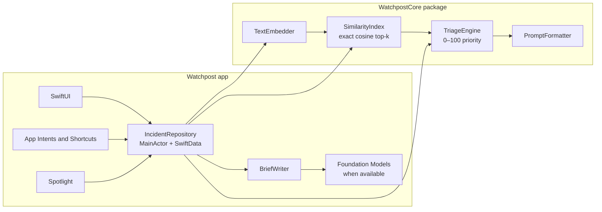

# Watchpost

**Incident intelligence that stays on your device.**

Watchpost is a native SwiftUI incident-triage app for iPhone, iPad, and Mac. It connects incident correlation and triage to Siri, Shortcuts, and Spotlight, without sending incident content to a cloud AI service.

Similar incidents are found with local text embeddings and exact cosine similarity. When Apple Intelligence is available, Apple's on-device Foundation Model writes the triage brief; otherwise, a deterministic rules engine supplies it. Either way, the priority score comes from the same testable 0–100 triage engine.

> Watchpost is a native, privacy-first evolution of [AURORA](https://github.com/Vaidehi2510/AURORA), moving incident correlation from a cloud-backed web dashboard onto Apple platforms.

## What it does

| Capability | In practice |
|---|---|
| **Triage, on device** | Finds related incidents, assigns a deterministic priority score, and produces a concise brief. Embeddings are cached in SwiftData. |
| **Siri and Shortcuts** | Log, triage, find open incidents, resolve, and open incidents through five App Intents and three ready-to-use App Shortcuts. |
| **Search where you work** | Search incident entities in Shortcuts, then filter and branch on their title, severity, open state, and creation date. Spotlight results open the matching incident. |
| **Native across Apple platforms** | A shared SwiftUI interface supports iPhone, iPad, and Mac, with a macOS menu-bar summary. |
| **Privacy by design** | Incident records and model-assisted brief generation stay on device. No cloud inference service is involved. |

## See it in action

1. Launch Watchpost once to load 30 sample incidents and register its shortcuts.
2. Ask Siri: “Show open incidents in Watchpost.”
3. Or build a Shortcut: **Get Open Incidents (Critical) → Repeat with Each → Triage Incident**.
4. Search for `ransomware` in Spotlight and open a result to jump straight to that incident.

## How it is built



- **One source of truth:** the UI, intents, and Spotlight use one `@MainActor` repository and its SwiftData `ModelContext`.
- **Clear concurrency boundary:** SwiftData models stay on the main actor; `IncidentSnapshot` value types cross into the core package and back to intents.
- **Predictable ranking:** generated prose never determines priority. `TriageEngine` computes the score, keeping ordering testable and consistent.
- **Model-aware cache:** each stored embedding records the embedding model identifier, allowing vectors to be refreshed when the OS model changes.

## Build and run

**Requirements:** Xcode 16 or later; iOS 18 or later; macOS 15 or later. Foundation Models brief generation requires Xcode 26 and a supported Apple Intelligence device. The rules-based brief remains available when the on-device model is unavailable.

```bash
brew install xcodegen
xcodegen generate
open Watchpost.xcodeproj
```

In Xcode, choose the **Watchpost** scheme and an iPhone simulator or **My Mac** destination. Set your development team under **Signing & Capabilities**, then run with **⌘R**.

## Tests

Run the platform-independent core suite from the repository root:

```bash
swift test --package-path Packages/WatchpostCore
```

To run the app-level repository tests, open the generated Xcode project and press **⌘U**. Those tests use an in-memory SwiftData store.

## Project layout

```text
Watchpost/                 SwiftUI app, intents, persistence, and platform bridge
Packages/WatchpostCore/    Embedding, similarity search, and triage engine
WatchpostTests/            App-level repository tests
project.yml                XcodeGen project definition
```

## Profiling

- Use **Time Profiler** while generating briefs to compare cold and warm embedding-cache behavior in `SentenceEmbedder.embed` and `SimilarityIndex.nearest`.
- Use the **SwiftUI** instrument while typing in search to inspect view updates.
- Set an LLDB breakpoint in `IncidentRepository.similarIncidents` to inspect matches and the stored embedding model identifier.

## Roadmap

- Interactive widget and Control Center control backed by `ResolveIncidentIntent`.
- Focus filter for on-call severity views.
- Shared `AppIntentsPackage` for intents used by app and widget extensions.
